##### HOSTING A WORDPRESS WEBSITE WITH AWS EC2 

Our goal is to host a website for xxxxxx solicitors on an Amazon EC2 Instance

For this, we shall need the following resources
An EC2 Instance running on Linux. I will go for the t2.micro 
An elastic IP so that the IP address will persist if the instance is stopped or interrupted
SSH into the Instance and install the following:
Security group to allow SSH into our instance for software installation and bootstrapping if required
Security group to allow HTTP and HTTPS traffic from the internet
An SSL Certificate to encrypt inflight data
A Domain name and A record for forwarding to our Elastic IP

- Apache Webserver
- PHP 
- Mysql

Install Wordpress

Additional Tools
- Github for version control and to document our actions
- VSCode - Code/Text Editor

#### 1. LAUNCH EC2 INSTANCE
------
We shall go to the AWS console and launch an Instance

- We shall name our instance InstanceNameOfChoice
- Select Ubuntu for our AMI (My Preference today)
- Instance type will be t2.micro
- Security groups ingress 
- SSH(Port 22) - Allow from your IP Adress only  xx.xx.xx.xx/32
- http(Port 80) Allow All 0.0.0.0/0 
- https(Port 443) Allow All 0.0.0.0/0


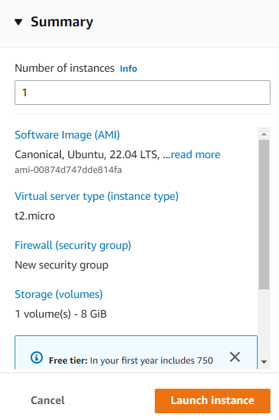

#### 2. ATTACH AN ELASTIC IP
EC2 Instance's public IP addresses change when the instance is stopped and relaunched. To avoid losing
the ip address to our application, we shall use an Elastic IP address and attach it to our EC2 Instance.

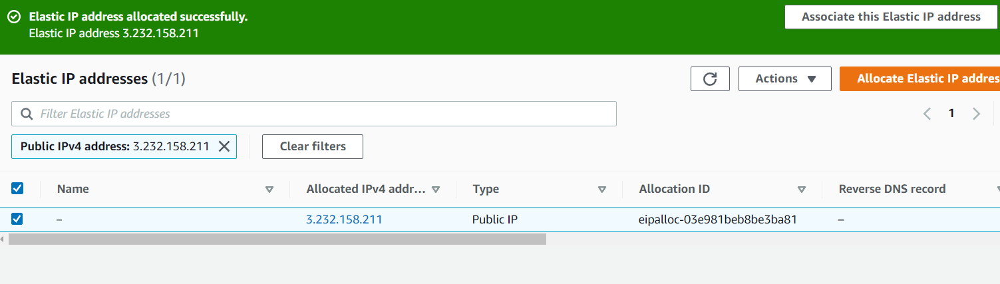

#### 3. ASSOCIATE ELASTIC IP
#### Attach it to our instance

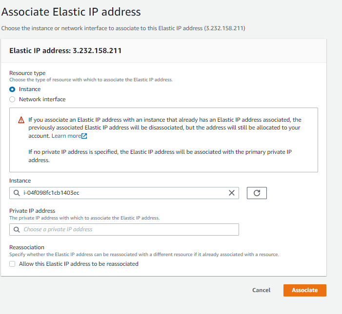

#### OUR INSTANCE PUBLIC IP ADDRESS HAS NOW CHANGED TO THE ELASTIC IP ADDRESS

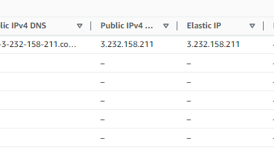

#### 4. WE SHALL NOW SSH INTO OUR INSTANCE
#### Let's SSH into our instance using our new and persistent IP address

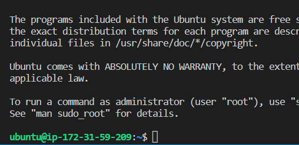

```
sudo apt update	
```

##### 5. Install Apache
```
sudo apt install apache2 -y
```

##### Let's check the status to see if Apache is up and running
```
~$ sudo systemctl status apache2
● apache2.service - The Apache HTTP Server
     Loaded: loaded (/lib/systemd/system/apache2.service; enabled; vendor preset: enabled)
     Active: active (running) since Mon 2023-02-06 22:13:21 UTC; 1min 59s ago
       Docs: https://httpd.apache.org/docs/2.4/
   Main PID: 2424 (apache2)
      Tasks: 55 (limit: 1143)
     Memory: 4.9M
        CPU: 34ms
     CGroup: /system.slice/apache2.service
             ├─2424 /usr/sbin/apache2 -k start
             ├─2426 /usr/sbin/apache2 -k start
             └─2427 /usr/sbin/apache2 -k start

Feb 06 22:13:21 ip-172-31-59-209 systemd[1]: Starting The Apache HTTP Server...
Feb 06 22:13:21 ip-172-31-59-209 systemd[1]: Started The Apache HTTP Server.
```

##### visit the public IP address on our browser to see if Apache is successfully installed.
##### Apache successfully installed.

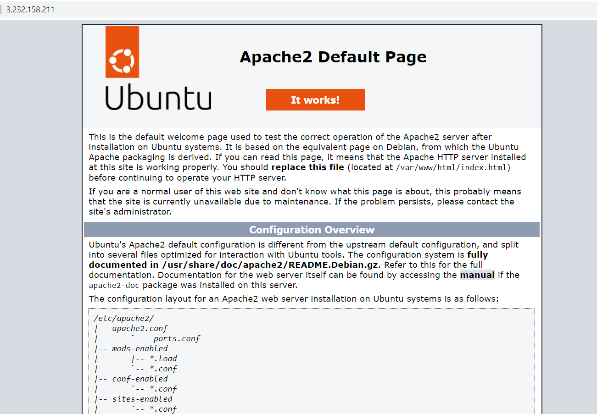

##### 6. Our next task is to install PHP runtime which is required for wordpress which is built on PHP

We shall  instal the php package, php-mysql (a PHP module that allows PHP to communicate with MySQL-based databases, as well as  libapache2-mod-php to enable Apache to handle PHP files. 
```
sudo apt update
sudo apt install php libapache2-mod-php php-mysql
```

##### 7. Next step is to install MySql server

```
sudo apt install mysql-server
```

##### 8. We need to change the MySql authentication to MySql native password
This is necessary for Wordpress to be able to log in as an ordinary user.

Lets log in to mysql as the root user

```
sudo mysql -u root
```
```
ALTER USER 'root'@localhost IDENTIFIED with mysql_native_password BY 'secretpassordofyourchoice'
Query OK, 0 rows affected (0.01 sec)
```

##### 9. Now let's create a new mysql user

```
CREATE USER 'usertester'@localhost IDENTIFIED BY PASSWORD 'thenewuserpassword'
```
##### New mysql user created

##### 10. Next, we shall create a database for our Wordpress and grant permissions on it to our new user.
```
CREATE DATABASE databasenameofyourchoice;        ### wp_melrose       Olupero2023%melrose     'goldeneyepr'@localhost
Query OK, 1 row affected (0.00 sec)
```
##### G11. rant all privileges on the database to the user
```
GRANT ALL PRIVILEGES ON databasenameofyourchoice.* TO 'usertester'@localhost;
Query OK, 0 rows affected (0.00 sec)
```
##### Let's exit mysql using CTRL+D if on a windows pc.

##### Let's first download wordpress to out tmp directory before copying to our var/www/html directory
```
cd \tmp
```
##### 12. Download wordprss using wget
```
wget https://wordpress.org/latest.tar.gz
```

##### 13. Extract the package using 
```
tar -xzvf latest.tar.gz
```
##### Wordpress is now dowloaded to our tmp folder

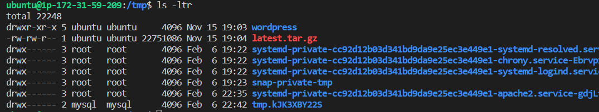

##### 14 . Move wordpress to our root folder
```
sudo mv wordpress/ /var/www/html/
```

we can check out wordpress installation by going to ourelasticipaddress/wordpress in our browser
```
http://ourelasticipaddress/wordpress
```
  
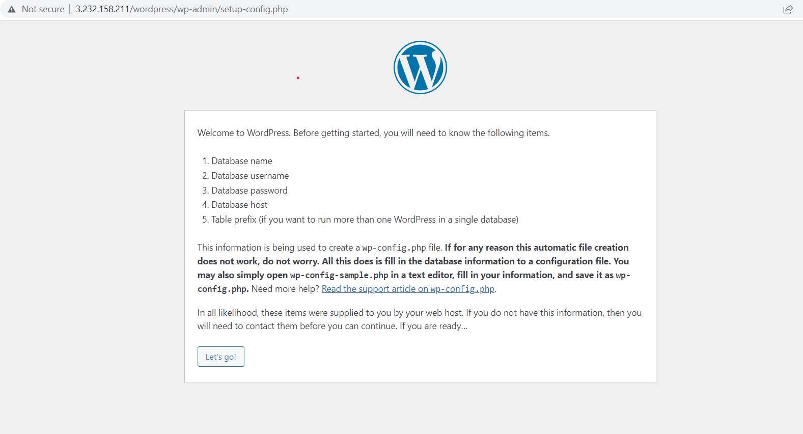

##### Fill out the credentials for username, database name, db password 

##### You will get an unable to write to wp_config.php error

##### Create the wp_config.php file in the wordpress directory and copy and paste the generated code inside it

##### Save and exit.

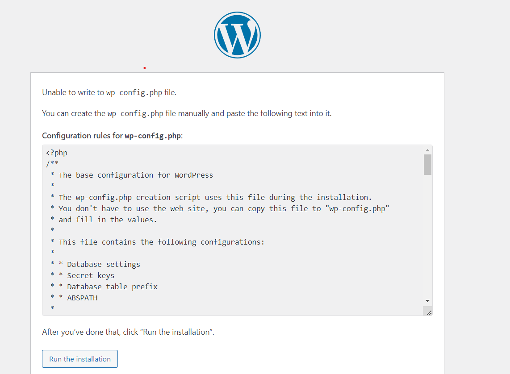
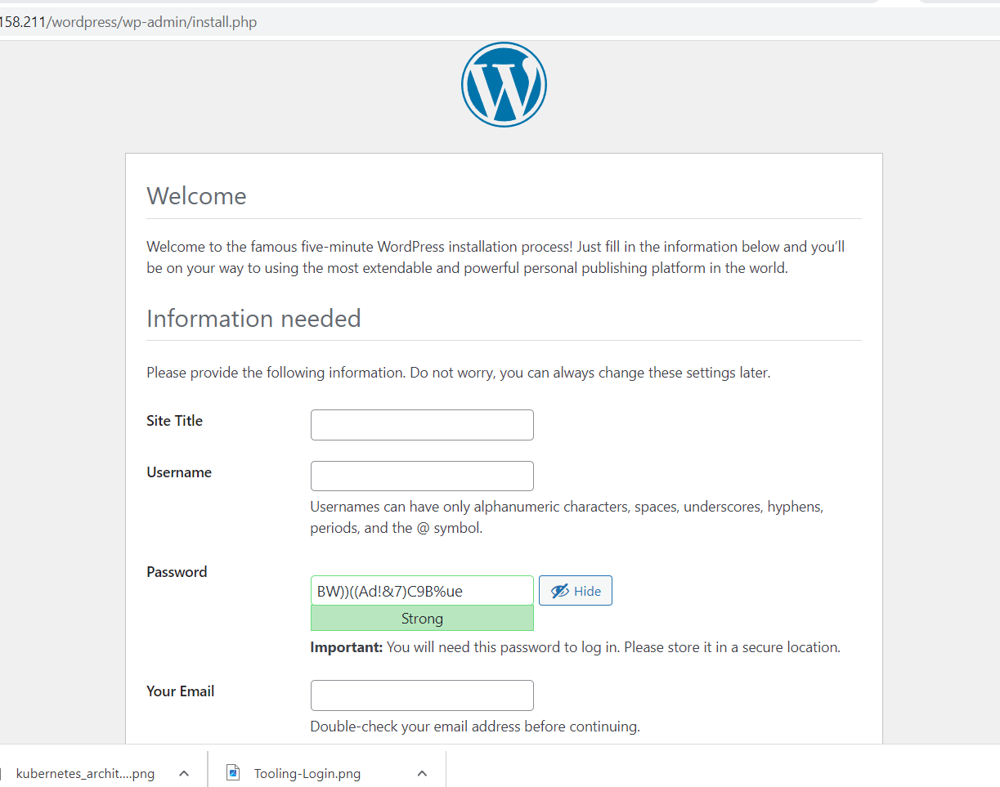

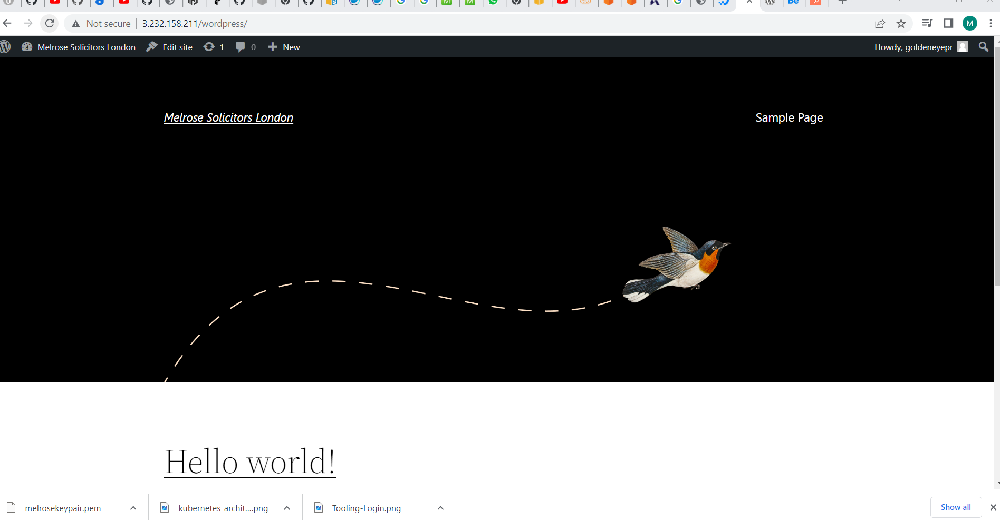